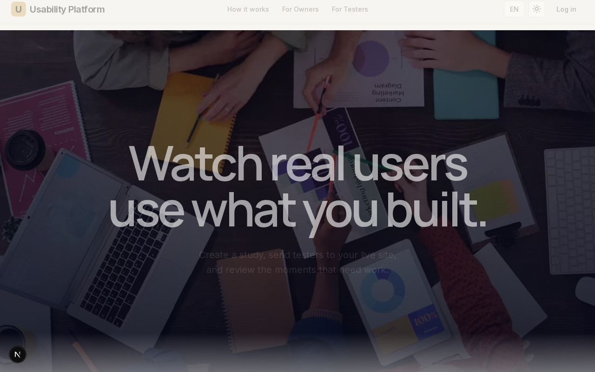
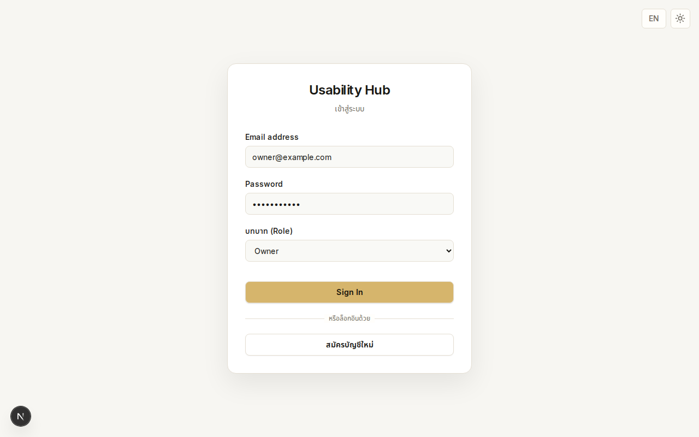
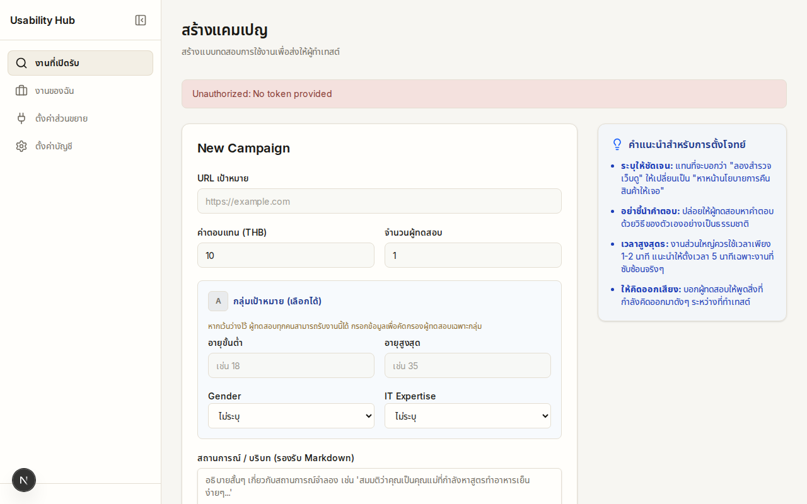
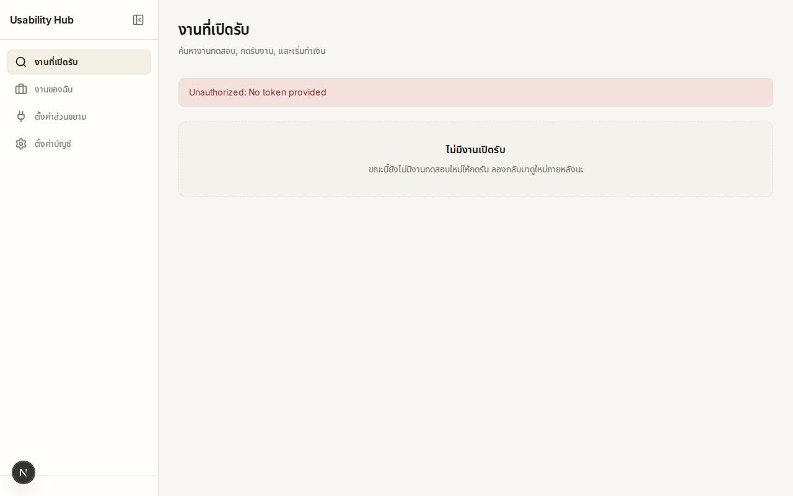

# Usability Testing Platform MVP

แพลตฟอร์ม MVP สำหรับเชื่อม Owner ที่ต้องการทดสอบเว็บไซต์กับ Tester ที่ทำงานผ่าน Web Dashboard + Chrome Extension (Manifest V3) + Express API + PostgreSQL


## ภาพตัวอย่าง (Screenshots)






## Product & Web Identity — Future Test Lab 2030

> **AI assists. Humans experience. Researchers decide.**

โปรเจกต์นี้ไม่ได้ต้องการเป็นเพียง SaaS สำหรับสร้าง usability test แต่มีทิศทางระยะยาวเป็น **human-centered research environment** สำหรับค้นหาผู้เข้าร่วมที่เหมาะกับคำถามวิจัย สังเกตว่ามนุษย์มีประสบการณ์กับ digital product อย่างไร และเปลี่ยน observation เหล่านั้นให้เป็น evidence ที่ Researcher ใช้ประกอบการตัดสินใจได้

แนวคิดหลักของแบรนด์และ Landing Page คือ **Future Test Lab 2030** — โลกอนาคตอันใกล้ที่รวม Human Behavior, AI-assisted Research, Participant Qualification, HCI, Industrial Design, Architecture และ Digital Technology เข้าด้วยกัน โดยเทคโนโลยีควรมีความสามารถสูงแต่ “quiet”: อยู่เบื้องหลังเพื่อช่วยให้เราเข้าใจมนุษย์ ไม่ใช่แย่งความสนใจจากมนุษย์

### Brand North Star

> **Find the right people. Observe real behavior. Build evidence. Let humans decide.**

สิ่งที่แบรนด์ต้องการสื่อไม่ใช่ “เรามี dashboard และ feature เยอะ” แต่คือ:

- หาคนที่เหมาะกับ research question
- ส่งคนจริงเข้าไปใช้ product จริง
- สังเกตช่วงเวลาที่มีความลังเล ความเข้าใจผิด การค้นหา การตัดสินใจ และการ recover
- เก็บ feedback และ interaction context ให้เป็นหลักฐาน
- ให้ Researcher เป็นผู้ตีความและตัดสินใจจาก evidence เหล่านั้น

### Human + AI Philosophy

AI ในระบบมีบทบาทเป็น **research assistant** ไม่ใช่ authority เหนือผู้เข้าร่วมวิจัย

AI สามารถช่วย:

`screen → structure → qualify → match → organize → summarize → surface`

แต่ไม่ควรทำหน้าที่:

`judge → diagnose → decide`

ทิศทางในอนาคตอาจรวม **AI-assisted online video screening** เพื่อช่วยคัดกรอง Tester ด้วย structured, study-relevant questions และสร้าง Research Participation Profile ที่เหมาะกับการ matching เช่น domain familiarity, device familiarity, language capability, think-aloud readiness, communication style และ study-specific eligibility

ระบบไม่ควรใช้ใบหน้า รูปลักษณ์ หรือ inferred traits เพื่อสร้างคะแนนประเภท personality, trustworthiness, intelligence, mental state หรือคุณค่าของบุคคล และไม่ควรให้ AI ตัดสินผู้เข้าร่วมแบบอัตโนมัติ

> **AI prepares the research. Humans create the evidence. Researchers make the decision.**

> หมายเหตุ: AI-assisted screening, qualification และ matching เป็น **product/identity direction** สำหรับการพัฒนาต่อ ไม่ได้หมายความว่า feature เหล่านี้ถูก implement ครบแล้วใน MVP ปัจจุบัน

### Visual Identity

Landing Page ควรถูกออกแบบเป็น **cinematic human-centered research experience** มากกว่า conventional SaaS marketing page

Visual world หลัก:

- contemporary editorial photography
- experimental HCI / interaction research
- architecture และ industrial design
- graphite, stone, concrete, brushed metal, frosted glass
- warm directional light / restrained soft amber
- plausible near-future technology
- real people captured between actions rather than staged poses

ควรหลีกเลี่ยง:

- generic SaaS card-grid identity
- café / coworking startup photography
- corporate stock-photo meetings
- blue cyberpunk / neon sci-fi
- gamer RGB
- floating holograms
- facial-scanning aesthetics
- AI scoring humans
- dashboard screenshots ที่ครองทุก section

Technology ในโลกนี้ควรเป็น **advanced but plausible** — future ผ่าน refinement ไม่ใช่ spectacle

### Core Visual Metaphor

แกนของ visual storytelling คือ **Observation**

คำและแนวคิดที่สามารถใช้ซ้ำใน product language และ visual system:

`STUDY · QUALIFICATION · OBSERVATION · TRACE · EVIDENCE · DECISION`

Landing Page ควรทำให้ user รู้สึกว่ากำลังค่อย ๆ มองเห็นพฤติกรรมที่ปกติหลุดรอดไป มากกว่าถูกนำเสนอ feature ทีละ card

### Landing Narrative

ทิศทางการเล่าเรื่องหลัก:

```text
Enter the Lab
→ Find the Right Humans
→ Design the Study
→ Human Meets Product
→ Enter the Digital Experience
→ Evidence Emerges
→ Researcher Understands
→ Decision
```

ภาพ, typography, copy, UI overlays และ animation ควรช่วยเล่าเรื่องเดียวกันนี้

### Motion Identity

Motion language คือ **Observed Movement**

การเคลื่อนไหวควร slow, deliberate, layered, reversible และ scroll-linked:

- scroll down = research progresses
- scroll up = research rewinds
- content reveal / accumulate / converge / pause / trace
- foreground และ background เคลื่อนต่าง depth กัน
- UI ปรากฏเป็น contextual evidence แทนการเป็น decoration

หลีกเลี่ยง bounce, random scale/rotation, aggressive spring และ animation ที่ไม่มีหน้าที่ใน narrative

### Landing vs Product App

Landing Page และ authenticated app ไม่จำเป็นต้องมีความ cinematic เท่ากัน:

- **Landing** = identity, atmosphere, storytelling
- **Product App** = clarity, productivity, research work

ทั้งสองส่วนควรแชร์ DNA เช่น typography hierarchy, shape language, status semantics, spacing และ interaction restraint แต่ dashboard ไม่ควรเสีย usability เพื่อทำตาม visual drama ของ Landing Page

### Creative Decision Filter

ก่อนเพิ่ม image, animation, component, color หรือ AI feature ให้ถาม:

> **Does this help us understand humans better?**

> **Does AI here assist the research, or is it replacing human judgment?**

> **Does this strengthen Future Test Lab 2030, or does it simply make the page look like another SaaS website?**

## Architecture

```text
apps/
  web/        Next.js dashboard for OWNER / TESTER
  api/        Express + TypeScript + Prisma
  extension/  Chrome Extension (Manifest V3)
packages/
  shared/     Shared TypeScript contracts
```

Core flow:

```text
Owner creates campaign
→ Tester claims one available job
→ Tester syncs authenticated session to Extension
→ Extension activates only when the claimed job matches the current target URL
→ Tester completes every task and submits responses
→ Owner reads the responses
→ Owner approves or rejects the submission
```

Video recording and real payment processing remain intentional MVP placeholders.

## Local configuration

Do not commit real secrets. Copy the example environment file first:

```bash
cp .env.example .env
```

Set at least:

```env
JWT_SECRET=use-a-long-random-development-secret
NEXT_PUBLIC_API_URL=http://localhost:4000
NEXT_PUBLIC_EXTENSION_ID=
```

The API intentionally fails to start when `JWT_SECRET` is missing.

For running the API outside Docker, copy `apps/api/.env.example` to `apps/api/.env`.

## Run Web + API + PostgreSQL

```bash
docker compose up -d --build
```

Then open:

- Web: http://localhost:3000
- API health: http://localhost:4000/health

Prisma migrations are applied with `prisma migrate deploy`.

## Build the Chrome Extension

From the repository root:

```bash
pnpm install
cd apps/extension
EXTENSION_API_URL=http://localhost:4000 WEB_APP_ORIGINS='http://localhost/*' pnpm build
```

Load `apps/extension/dist` from `chrome://extensions` using **Load unpacked**.

Copy the generated Extension ID into the root `.env`:

```env
NEXT_PUBLIC_EXTENSION_ID=<your-extension-id>
```

Then rebuild/restart the Web app so the public environment variable is embedded into the Next.js build.

The source manifest keeps only the permissions required by the current architecture: storage plus host access/content-script injection for arbitrary test targets. The previous broad DNR/CSP/X-Frame-Options rewriting is not used.

## Manual end-to-end test

### 1. Owner

1. Register `owner@example.com` / `password123` as **OWNER**.
2. Create a campaign with target `https://example.com`.
3. Add two tasks.
4. Confirm one job is shown as `AVAILABLE`.

### 2. Tester

1. Register a second account as **TESTER**.
2. Click **Sync Auth to Chrome Extension**.
3. Confirm the Extension popup reports an authenticated state.
4. Claim the Owner's job.
5. Use **Open target website**.

### 3. Extension

1. The overlay should appear only when the current URL matches a claimed job's target URL.
2. Enter a response for every task.
3. Submit once.
4. The submit control is disabled while the request is in flight.
5. API/validation/network failures must be displayed as failures rather than false success.

### 4. Owner review

1. Refresh the Owner dashboard.
2. The job should show `SUBMITTED`.
3. Click **View submission**.
4. Read every task and Tester response.
5. Only after the submission is loaded, click **Approve** or **Reject**.
6. A reviewed job cannot be reviewed a second time.

## Integrity rules implemented

- Passwords are bcrypt hashed.
- JWT signing has no source-code fallback secret.
- OWNER/TESTER API role checks are enforced.
- Job claim uses a conditional atomic update so only one Tester can win.
- A submission must contain every campaign task exactly once.
- Foreign task IDs and duplicate task IDs are rejected.
- `TaskResponse(jobId, taskId)` is unique in PostgreSQL.
- `CLAIMED → SUBMITTED` and `SUBMITTED → APPROVED/REJECTED` are conditional state transitions.
- Job lifecycle timestamps track claim, submission and review.
- Owner review verifies campaign ownership.
- Extension API calls check HTTP status and propagate validation/auth/network errors.

## Verification

With PostgreSQL available and the environment configured:

```bash
pnpm install
pnpm --filter @usability-testing/api db:generate
pnpm --filter @usability-testing/api db:migrate:deploy
pnpm typecheck
pnpm build
pnpm lint
pnpm test
```

The API integration test covers:

- register/login authentication infrastructure
- OWNER/TESTER authorization
- concurrent job claiming
- foreign task rejection
- duplicate task rejection
- unauthorized submission
- owner-only submission review
- one-way approve/reject transition
- concurrent/double submission

GitHub Actions runs the same build/type/lint/integration-test verification against PostgreSQL for pull requests.
